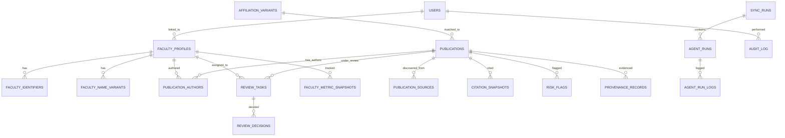

# Data Model — Faculty Research Publication Monitoring System

> **Version**: 0.1 (Phase 0)
> **Date**: 2026-09-11
> **Database**: PostgreSQL 16 + pgvector

---

## 1. CSV Source Analysis

### 1.1 Source File

| Property | Value |
|----------|-------|
| **File** | `data/raw/faculty_profiles.csv` |
| **Rows** | 24 faculty members |
| **Columns** | 16 |
| **Encoding** | UTF-8 with BOM |
| **Delimiter** | Comma |
| **Institution** | Vignan's Foundation for Science, Technology & Research (VFSTR) |

### 1.2 Column Completeness

| Column | Populated | % | Quality Notes |
|--------|-----------|---|---------------|
| Name | 24/24 | 100% | Inconsistent casing (mixed case vs ALL CAPS), includes titles (Dr/Mr/Ms), one name has leading dot |
| Title (Designation) | 24/24 | 100% | PROFESSOR, ASSOCIATE PROFESSOR, ASSISTANT PROFESSOR |
| Phone | 24/24 | 100% | Format varies |
| Email | 24/24 | 100% | 23 @vignan.ac.in, 1 @gmail.com |
| Research Interests | 22/24 | 91% | Pipe-delimited, 2 missing |
| Teaching Engagements | 21/24 | 87% | Free text, 3 missing |
| Academic Experience | 21/24 | 87% | Free text, 3 missing |
| Education | 22/24 | 91% | Semi-structured, pipe-delimited, 2 missing |
| Research | 13/24 | 54% | Free text, 11 missing |
| Awards | 10/24 | 41% | Free text, 14 missing |
| Memberships | 11/24 | 45% | Free text, 13 missing |
| Publications Count | 24/24 | 100% | Integer, ranges 0–43 |
| Publications | 19/24 | 79% | Pipe-delimited, unstructured text, 5 empty (matching 0 count) |
| Conferences | 11/24 | 45% | Free text, 13 missing |
| Events | 4/24 | 16% | Free text, 20 missing |
| Administrative Positions | 7/24 | 29% | Free text, 17 missing |

### 1.3 Data Quality Issues

| Issue | Details | Count |
|-------|---------|-------|
| **Inconsistent name casing** | "Dr MD OQAIL AHMAD" vs "Dr M Umadevi" | ~8 names in ALL CAPS |
| **Name with leading dot** | "Mr .Kiran Kumar Kaveti" | 1 |
| **Name with trailing dot** | "Dr Vijitha Ananthi J.", "Ms Bhimavarapu. Jyothika" | 2 |
| **Non-institutional email** | "rajumtech6@gmail.com" | 1 |
| **Department not explicit** | Inferred from email suffix only | All 24 |
| **Publications as free text** | Pipe-delimited strings, not structured records | 201 total |
| **DOIs embedded in text** | Some publications contain DOI, most don't | 40/201 (~20%) |
| **Index info in text** | Some have "{SCIE, IF: 4}" annotations | ~15 |
| **No external identifiers** | ORCID, Scopus ID, OpenAlex ID, etc. all missing | 24/24 |
| **No citation data** | No h-index, i10-index, citation counts | 24/24 |

### 1.4 Department Distribution (Inferred from Email)

| Department | Count | Notes |
|-----------|-------|-------|
| CSE | 18 | `_cse@` in email |
| EEE | 1 | `_eee@` in email |
| MECH | 1 | `_mech@` in email |
| ACSE | 1 | `_acse@` in email (Applied CSE?) |
| Unknown | 3 | Email prefix doesn't follow dept pattern |

### 1.5 Publication Statistics

| Metric | Value |
|--------|-------|
| Total publications declared | 201 |
| Total publication text entries | 201 |
| Publications with DOI in text | 40 (20%) |
| Faculty with 0 publications | 5 |
| Faculty with >10 publications | 6 |
| Max publications (single faculty) | 43 (Dr Prashant Upadhyay) |
| Publications with indexing info | ~15 |

### 1.6 Missing Fields Required by Problem Statement

| Required Field | Status |
|---------------|--------|
| faculty_id / unique identifier | ✗ Missing — name is not a safe PK |
| Normalized name | ✗ Missing — names have inconsistent format |
| Department | ✗ Missing — only inferable from email |
| ORCID | ✗ Missing |
| OpenAlex ID | ✗ Missing |
| Semantic Scholar ID | ✗ Missing |
| Scopus Author ID | ✗ Missing |
| Web of Science ResearcherID | ✗ Missing |
| Google Scholar Profile | ✗ Missing |
| Name variants | ✗ Missing |
| Affiliation variants | ✗ Missing |
| Structured publication records | ✗ Missing (free text only) |
| DOI per publication | ✗ Only 20% have DOI in text |
| Citation counts | ✗ Missing |
| h-index | ✗ Missing |
| i10-index | ✗ Missing |
| Verification status | ✗ Missing |

---

## 2. Database Schema

### 2.1 Entity Relationship Overview



### 2.2 Core Tables

#### `users`
```sql
CREATE TABLE users (
    id              UUID PRIMARY KEY DEFAULT gen_random_uuid(),
    email           VARCHAR(255) UNIQUE NOT NULL,
    password_hash   VARCHAR(255) NOT NULL,
    full_name       VARCHAR(255) NOT NULL,
    role            VARCHAR(50) NOT NULL CHECK (role IN ('faculty', 'dept_admin', 'research_admin', 'super_admin')),
    faculty_id      UUID REFERENCES faculty_profiles(id),  -- NULL for non-faculty admins
    is_active       BOOLEAN DEFAULT true,
    last_login_at   TIMESTAMPTZ,
    created_at      TIMESTAMPTZ DEFAULT NOW(),
    updated_at      TIMESTAMPTZ DEFAULT NOW()
);
```

#### `faculty_profiles`
```sql
CREATE TABLE faculty_profiles (
    id                  UUID PRIMARY KEY DEFAULT gen_random_uuid(),
    
    -- Original source data (preserved exactly as-is)
    raw_name            VARCHAR(255) NOT NULL,       -- "Dr M Umadevi"
    raw_designation     VARCHAR(100),                 -- "ASSOCIATE PROFESSOR"
    raw_email           VARCHAR(255),
    raw_phone           VARCHAR(50),
    
    -- Normalized identity
    normalized_name     VARCHAR(255) NOT NULL,       -- "m umadevi"
    first_name          VARCHAR(100),                 -- "Maramreddy" (parsed/discovered)
    last_name           VARCHAR(100),                 -- "Umadevi"
    title_prefix        VARCHAR(20),                  -- "Dr"
    
    -- Institutional
    department          VARCHAR(100),                 -- "CSE"
    designation         VARCHAR(100),                 -- "Associate Professor"
    institutional_email VARCHAR(255),
    phone               VARCHAR(50),
    
    -- Research profile
    research_interests  TEXT[],                       -- ARRAY of interests
    education           JSONB,                        -- Structured education records
    academic_experience TEXT,
    
    -- CSV source tracking
    csv_row_hash        VARCHAR(64),                  -- SHA-256 of original CSV row
    source_file         VARCHAR(255),                 -- "faculty_profiles.csv"
    
    -- Status
    status              VARCHAR(20) DEFAULT 'active' CHECK (status IN ('active', 'inactive', 'on_leave')),
    
    -- Timestamps
    created_at          TIMESTAMPTZ DEFAULT NOW(),
    updated_at          TIMESTAMPTZ DEFAULT NOW()
);

CREATE INDEX idx_faculty_normalized_name ON faculty_profiles(normalized_name);
CREATE INDEX idx_faculty_department ON faculty_profiles(department);
CREATE INDEX idx_faculty_email ON faculty_profiles(institutional_email);
```

#### `faculty_identifiers`
```sql
CREATE TABLE faculty_identifiers (
    id              UUID PRIMARY KEY DEFAULT gen_random_uuid(),
    faculty_id      UUID NOT NULL REFERENCES faculty_profiles(id),
    identifier_type VARCHAR(50) NOT NULL,  -- 'orcid', 'openalex', 'semantic_scholar', 'scopus', 'wos', 'google_scholar'
    identifier_value VARCHAR(255) NOT NULL,
    verified        BOOLEAN DEFAULT false,
    verification_source VARCHAR(100),      -- How was this verified?
    confidence      FLOAT CHECK (confidence >= 0 AND confidence <= 1),
    discovered_at   TIMESTAMPTZ DEFAULT NOW(),
    verified_at     TIMESTAMPTZ,
    created_at      TIMESTAMPTZ DEFAULT NOW(),
    
    UNIQUE(faculty_id, identifier_type, identifier_value)
);

CREATE INDEX idx_faculty_id_type ON faculty_identifiers(identifier_type, identifier_value);
```

#### `faculty_name_variants`
```sql
CREATE TABLE faculty_name_variants (
    id              UUID PRIMARY KEY DEFAULT gen_random_uuid(),
    faculty_id      UUID NOT NULL REFERENCES faculty_profiles(id),
    name_variant    VARCHAR(255) NOT NULL,
    variant_source  VARCHAR(100),          -- 'csv_parse', 'publication', 'orcid', 'manual'
    is_confirmed    BOOLEAN DEFAULT false,
    created_at      TIMESTAMPTZ DEFAULT NOW(),
    
    UNIQUE(faculty_id, name_variant)
);

CREATE INDEX idx_name_variant ON faculty_name_variants(name_variant);
```

#### `affiliation_variants`
```sql
CREATE TABLE affiliation_variants (
    id                  UUID PRIMARY KEY DEFAULT gen_random_uuid(),
    canonical_name      VARCHAR(500) NOT NULL,  -- "Vignan's Foundation for Science, Technology & Research"
    variant_text        VARCHAR(500) NOT NULL,
    variant_normalized  VARCHAR(500) NOT NULL,  -- Lowercase, stripped
    department          VARCHAR(100),            -- If department-specific
    is_confirmed        BOOLEAN DEFAULT true,
    source              VARCHAR(100),            -- 'seed', 'discovered', 'manual'
    created_at          TIMESTAMPTZ DEFAULT NOW(),
    
    UNIQUE(variant_normalized)
);

CREATE INDEX idx_affiliation_normalized ON affiliation_variants(variant_normalized);
```

#### `publications`
```sql
CREATE TABLE publications (
    id                      UUID PRIMARY KEY DEFAULT gen_random_uuid(),
    
    -- Identity
    title                   TEXT NOT NULL,
    normalized_title        TEXT NOT NULL,            -- Lowercase, no punctuation
    doi                     VARCHAR(255),
    
    -- Metadata
    authors_raw             TEXT,                      -- Original author string
    authors_parsed          JSONB,                     -- [{name, affiliation, position}]
    publication_date        DATE,
    year                    INTEGER,
    month                   INTEGER,
    
    -- Venue
    journal_name            VARCHAR(500),
    conference_name         VARCHAR(500),
    publisher               VARCHAR(255),
    volume                  VARCHAR(50),
    issue                   VARCHAR(50),
    pages                   VARCHAR(50),
    issn                    VARCHAR(20),
    
    -- Classification
    publication_type        VARCHAR(50) CHECK (publication_type IN (
        'journal-article', 'conference-paper', 'book-chapter', 
        'preprint', 'thesis', 'patent', 'report', 'other'
    )),
    
    -- Content
    abstract                TEXT,
    keywords                TEXT[],
    
    -- Affiliation
    affiliation_text        TEXT,                      -- Raw affiliation from source
    affiliation_normalized  TEXT,                      -- Matched VFSTR variant
    affiliation_match_confidence FLOAT,
    
    -- Quality metrics
    indexing_status         TEXT[],                    -- ['SCIE', 'Scopus', 'ESCI']
    quartile                VARCHAR(10),               -- 'Q1', 'Q2', 'Q3', 'Q4'
    impact_factor           FLOAT,
    citescore               FLOAT,
    open_access             BOOLEAN,
    
    -- Citations (latest known)
    citation_count          INTEGER DEFAULT 0,
    citation_source         VARCHAR(50),               -- Which API provided this
    
    -- Verification
    verification_status     VARCHAR(30) DEFAULT 'pending' CHECK (verification_status IN (
        'pending', 'auto_verified', 'review_required', 
        'human_verified', 'human_rejected', 'human_corrected', 'conflict'
    )),
    attribution_confidence  FLOAT,
    metadata_confidence     FLOAT,
    
    -- Risk
    risk_level              VARCHAR(10) DEFAULT 'none' CHECK (risk_level IN ('none', 'low', 'medium', 'high')),
    risk_reasons            JSONB,                     -- [{type, evidence, confidence}]
    
    -- Source tracking
    first_seen_at           TIMESTAMPTZ DEFAULT NOW(),
    last_verified_at        TIMESTAMPTZ,
    source_csv_text         TEXT,                      -- Original text from CSV (if from CSV)
    
    -- Timestamps
    created_at              TIMESTAMPTZ DEFAULT NOW(),
    updated_at              TIMESTAMPTZ DEFAULT NOW()
);

CREATE INDEX idx_pub_doi ON publications(doi) WHERE doi IS NOT NULL;
CREATE INDEX idx_pub_normalized_title ON publications USING gin(to_tsvector('english', normalized_title));
CREATE INDEX idx_pub_year ON publications(year);
CREATE INDEX idx_pub_verification ON publications(verification_status);
CREATE INDEX idx_pub_risk ON publications(risk_level);
CREATE INDEX idx_pub_department ON publications USING gin(to_tsvector('english', affiliation_normalized));
```

#### `publication_authors`
```sql
CREATE TABLE publication_authors (
    id                      UUID PRIMARY KEY DEFAULT gen_random_uuid(),
    publication_id          UUID NOT NULL REFERENCES publications(id) ON DELETE CASCADE,
    faculty_id              UUID REFERENCES faculty_profiles(id),   -- NULL if not matched
    author_position         INTEGER,                                -- 1-indexed position in author list
    author_name_raw         VARCHAR(255),
    attribution_confidence  FLOAT,
    attribution_method      VARCHAR(100),                           -- 'orcid_match', 'name_affiliation', etc.
    is_corresponding        BOOLEAN DEFAULT false,
    created_at              TIMESTAMPTZ DEFAULT NOW(),
    
    UNIQUE(publication_id, faculty_id)
);

CREATE INDEX idx_pubauth_faculty ON publication_authors(faculty_id);
CREATE INDEX idx_pubauth_publication ON publication_authors(publication_id);
```

#### `publication_sources`
```sql
CREATE TABLE publication_sources (
    id                  UUID PRIMARY KEY DEFAULT gen_random_uuid(),
    publication_id      UUID NOT NULL REFERENCES publications(id) ON DELETE CASCADE,
    source_system       VARCHAR(50) NOT NULL,         -- 'openalex', 'crossref', 'csv_import', etc.
    source_id           VARCHAR(255),                  -- External ID in that system
    source_url          TEXT,
    raw_metadata        JSONB,                         -- Full API response stored
    discovered_at       TIMESTAMPTZ DEFAULT NOW(),
    discovery_method    VARCHAR(100),                   -- 'author_id', 'doi_lookup', 'name_search'
    sync_run_id         UUID REFERENCES sync_runs(id),
    created_at          TIMESTAMPTZ DEFAULT NOW()
);

CREATE INDEX idx_pubsrc_publication ON publication_sources(publication_id);
CREATE INDEX idx_pubsrc_source ON publication_sources(source_system, source_id);
```

#### `citation_snapshots`
```sql
CREATE TABLE citation_snapshots (
    id              UUID PRIMARY KEY DEFAULT gen_random_uuid(),
    publication_id  UUID NOT NULL REFERENCES publications(id) ON DELETE CASCADE,
    citation_count  INTEGER NOT NULL,
    source          VARCHAR(50) NOT NULL,        -- 'openalex', 'semantic_scholar', 'crossref'
    snapshot_date   DATE NOT NULL,
    created_at      TIMESTAMPTZ DEFAULT NOW(),
    
    UNIQUE(publication_id, source, snapshot_date)
);

CREATE INDEX idx_citation_pub ON citation_snapshots(publication_id);
CREATE INDEX idx_citation_date ON citation_snapshots(snapshot_date);
```

#### `faculty_metric_snapshots`
```sql
CREATE TABLE faculty_metric_snapshots (
    id                  UUID PRIMARY KEY DEFAULT gen_random_uuid(),
    faculty_id          UUID NOT NULL REFERENCES faculty_profiles(id),
    h_index             INTEGER NOT NULL DEFAULT 0,
    i10_index           INTEGER NOT NULL DEFAULT 0,
    total_citations     INTEGER NOT NULL DEFAULT 0,
    total_publications  INTEGER NOT NULL DEFAULT 0,
    verified_publications INTEGER NOT NULL DEFAULT 0,
    snapshot_date       DATE NOT NULL,
    created_at          TIMESTAMPTZ DEFAULT NOW(),
    
    UNIQUE(faculty_id, snapshot_date)
);

CREATE INDEX idx_metric_faculty ON faculty_metric_snapshots(faculty_id);
CREATE INDEX idx_metric_date ON faculty_metric_snapshots(snapshot_date);
```

### 2.3 Provenance & Audit Tables

#### `provenance_records`
```sql
CREATE TABLE provenance_records (
    id              UUID PRIMARY KEY DEFAULT gen_random_uuid(),
    entity_type     VARCHAR(50) NOT NULL,         -- 'publication', 'faculty', 'identifier'
    entity_id       UUID NOT NULL,
    event_type      VARCHAR(100) NOT NULL,         -- 'discovered', 'doi_confirmed', 'attributed', etc.
    source          VARCHAR(100),
    detail          TEXT,
    confidence      FLOAT,
    agent_name      VARCHAR(100),
    sync_run_id     UUID REFERENCES sync_runs(id),
    created_at      TIMESTAMPTZ DEFAULT NOW()
);

CREATE INDEX idx_prov_entity ON provenance_records(entity_type, entity_id);
CREATE INDEX idx_prov_created ON provenance_records(created_at);
```

#### `review_tasks`
```sql
CREATE TABLE review_tasks (
    id              UUID PRIMARY KEY DEFAULT gen_random_uuid(),
    task_type       VARCHAR(50) NOT NULL,          -- 'attribution_ambiguous', 'duplicate_uncertain', etc.
    priority        VARCHAR(10) DEFAULT 'medium' CHECK (priority IN ('low', 'medium', 'high', 'critical')),
    status          VARCHAR(20) DEFAULT 'pending' CHECK (status IN ('pending', 'in_review', 'resolved', 'deferred')),
    
    -- Context
    entity_type     VARCHAR(50),                   -- 'publication', 'faculty'
    entity_id       UUID,
    related_entity_id UUID,                        -- e.g., the other potential duplicate
    
    -- Evidence
    explanation     TEXT NOT NULL,                  -- Human-readable reason
    evidence        JSONB,                         -- Structured evidence for reviewer
    options         JSONB,                         -- Available actions
    
    -- Assignment
    assigned_to     UUID REFERENCES users(id),
    assigned_at     TIMESTAMPTZ,
    
    -- Resolution
    decision        VARCHAR(50),                   -- 'confirm', 'reject', 'merge', 'reassign', 'defer'
    decision_detail JSONB,
    decided_by      UUID REFERENCES users(id),
    decided_at      TIMESTAMPTZ,
    
    -- Metadata
    agent_name      VARCHAR(100),                  -- Which agent created this
    sync_run_id     UUID REFERENCES sync_runs(id),
    created_at      TIMESTAMPTZ DEFAULT NOW(),
    updated_at      TIMESTAMPTZ DEFAULT NOW()
);

CREATE INDEX idx_review_status ON review_tasks(status);
CREATE INDEX idx_review_priority ON review_tasks(priority);
CREATE INDEX idx_review_assigned ON review_tasks(assigned_to);
```

#### `audit_log`
```sql
CREATE TABLE audit_log (
    id              UUID PRIMARY KEY DEFAULT gen_random_uuid(),
    user_id         UUID REFERENCES users(id),
    action          VARCHAR(100) NOT NULL,         -- 'review_decision', 'faculty_update', 'publication_edit'
    entity_type     VARCHAR(50),
    entity_id       UUID,
    old_value       JSONB,
    new_value       JSONB,
    ip_address      INET,
    user_agent      TEXT,
    created_at      TIMESTAMPTZ DEFAULT NOW()
);

CREATE INDEX idx_audit_user ON audit_log(user_id);
CREATE INDEX idx_audit_entity ON audit_log(entity_type, entity_id);
CREATE INDEX idx_audit_created ON audit_log(created_at);
```

### 2.4 Agent Execution Tables

#### `sync_runs`
```sql
CREATE TABLE sync_runs (
    id              UUID PRIMARY KEY DEFAULT gen_random_uuid(),
    run_type        VARCHAR(50) NOT NULL,          -- 'full_sync', 'citation_refresh', 'manual'
    status          VARCHAR(20) DEFAULT 'running' CHECK (status IN ('running', 'completed', 'failed', 'paused')),
    trigger         VARCHAR(50),                   -- 'scheduled', 'manual', 'api'
    triggered_by    UUID REFERENCES users(id),
    
    -- Stats
    publications_discovered  INTEGER DEFAULT 0,
    publications_merged      INTEGER DEFAULT 0,
    publications_verified    INTEGER DEFAULT 0,
    review_tasks_created     INTEGER DEFAULT 0,
    errors_count             INTEGER DEFAULT 0,
    
    started_at      TIMESTAMPTZ DEFAULT NOW(),
    completed_at    TIMESTAMPTZ,
    created_at      TIMESTAMPTZ DEFAULT NOW()
);
```

#### `agent_runs`
```sql
CREATE TABLE agent_runs (
    id              UUID PRIMARY KEY DEFAULT gen_random_uuid(),
    sync_run_id     UUID REFERENCES sync_runs(id),
    agent_name      VARCHAR(100) NOT NULL,         -- 'discovery', 'normalization', etc.
    status          VARCHAR(20) DEFAULT 'running',
    
    -- I/O tracking
    input_count     INTEGER,                       -- Records processed
    output_count    INTEGER,                       -- Records produced
    error_count     INTEGER DEFAULT 0,
    
    -- Timing
    started_at      TIMESTAMPTZ DEFAULT NOW(),
    completed_at    TIMESTAMPTZ,
    duration_ms     INTEGER,
    
    -- Details
    config          JSONB,                         -- Agent configuration used
    errors          JSONB,                         -- Error details
    created_at      TIMESTAMPTZ DEFAULT NOW()
);

CREATE INDEX idx_agent_sync ON agent_runs(sync_run_id);
CREATE INDEX idx_agent_name ON agent_runs(agent_name);
```

### 2.5 Vector Search (pgvector)

```sql
-- For semantic publication search and title similarity
CREATE EXTENSION IF NOT EXISTS vector;

ALTER TABLE publications ADD COLUMN title_embedding vector(384);
-- Populated by sentence-transformers/all-MiniLM-L6-v2 or similar

CREATE INDEX idx_pub_embedding ON publications 
    USING ivfflat (title_embedding vector_cosine_ops) WITH (lists = 100);
```

---

## 3. Data Flow: Raw → Normalized → Verified

```
┌──────────────────┐
│  RAW SOURCE DATA │  faculty_profiles.csv (preserved in data/raw/)
│  (never modified)│  publication_sources.raw_metadata (API responses)
└────────┬─────────┘
         │ CSV Import / API Discovery
         ▼
┌──────────────────┐
│ NORMALIZED DATA  │  faculty_profiles (normalized fields)
│ (system-managed) │  publications (normalized metadata)
│                  │  faculty_identifiers (discovered IDs)
└────────┬─────────┘
         │ Verification pipeline
         ▼
┌──────────────────┐
│  VERIFIED DATA   │  publications WHERE verification_status IN
│  (human-approved)│    ('auto_verified', 'human_verified')
│                  │  faculty_identifiers WHERE verified = true
└────────┬─────────┘
         │ Metric computation
         ▼
┌──────────────────┐
│  DERIVED METRICS │  citation_snapshots
│  (computed)      │  faculty_metric_snapshots
│                  │  Reports, analytics
└──────────────────┘
```

---

## 4. CSV Import Mapping

| CSV Column | → Database Field(s) | Transformation |
|------------|---------------------|---------------|
| Name | `raw_name`, `normalized_name`, `first_name`, `last_name`, `title_prefix` | Parse title prefix, normalize casing |
| Title | `raw_designation`, `designation` | Normalize to Title Case |
| Phone | `raw_phone`, `phone` | Preserve as-is |
| Email | `raw_email`, `institutional_email` | Validate format |
| Research Interests | `research_interests` | Split by `\|`, trim |
| Teaching Engagements | (stored in JSONB metadata) | Preserve as-is |
| Academic Experience | `academic_experience` | Preserve as-is |
| Education | `education` (JSONB) | Parse into structured records |
| Research | (stored in JSONB metadata) | Preserve as-is |
| Awards | (stored in JSONB metadata) | Preserve as-is |
| Memberships | (stored in JSONB metadata) | Preserve as-is |
| Publications Count | (used for validation) | Compare against parsed count |
| Publications | → `publications` table (one row per pub) | Parse pipe-delimited, extract DOI/year/journal |
| Conferences | → `publications` table (type=conference-paper) | Parse pipe-delimited |
| Events | (stored in JSONB metadata) | Preserve as-is |
| Administrative Positions | (stored in JSONB metadata) | Preserve as-is |

> [!IMPORTANT]
> The original CSV is NEVER modified or deleted. It is preserved at `data/raw/faculty_profiles.csv`. All transformations create new database records with `source_file = 'faculty_profiles.csv'` and `csv_row_hash` for traceability.
