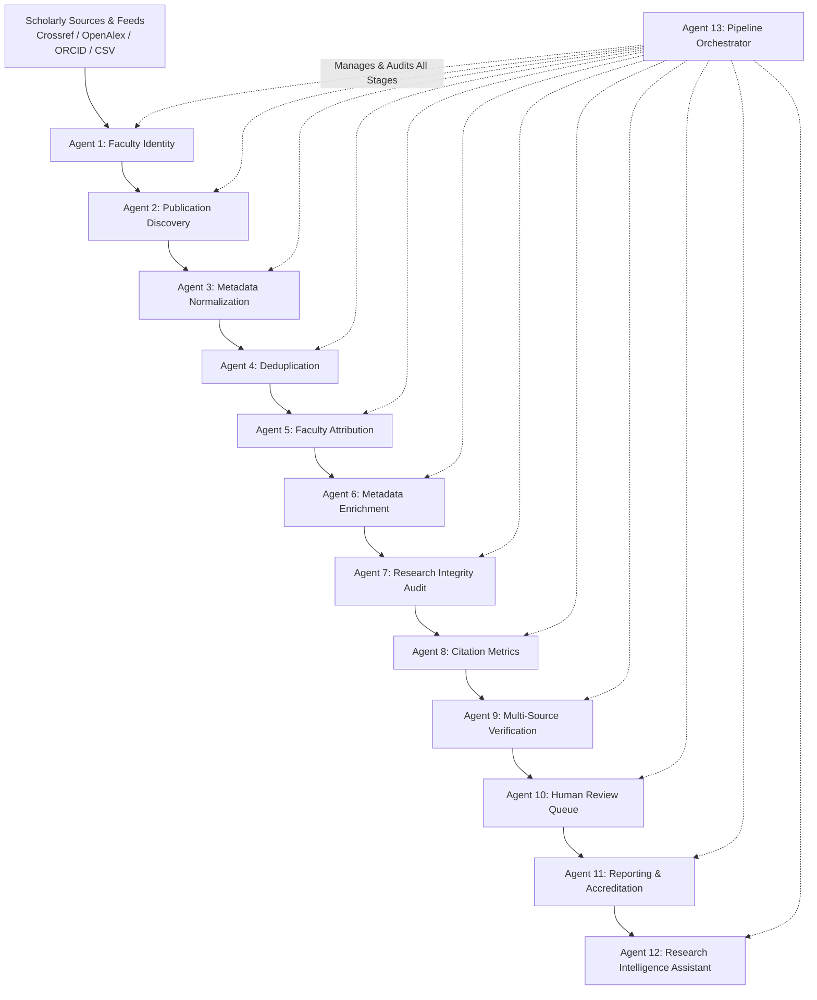

# Research Faculty Monitoring System — Project Review & Multi-Agent Architecture Guide

**Project Name:** Faculty Research Publication Monitoring System  
**Institution:** Vignan's Foundation for Science, Technology & Research (Deemed to be University)  
**System Type:** Multi-Agent Autonomous AI Research Publication & Impact Intelligence System  
**Version:** Production Baseline (Phases 1–16)  
**Author / Organization:** Department of Computer Science & Engineering / Research Cell  

---

## 1. Executive Summary

The **Research Faculty Monitoring System** is an institutional-grade, multi-agent automated platform designed to continuously discover, normalize, deduplicate, attribute, enrich, verify, and report faculty research publications, citations, and scholarly impact.

### Core Problem Solved:
Historically, academic institutions rely on burdensome, manual annual exercises—such as circulating spreadsheets and requesting self-reported faculty publication data. This leads to:
1. **Data Incompleteness & Delays:** Missed citations, lagging journal publications, and incomplete faculty profiles.
2. **Ambiguity & Disambiguation Errors:** Common author names, faculty switching institutions, and varied institutional affiliation strings.
3. **Double Counting & Formatting Discrepancies:** Multiple authors from the same department submitting the same publication in separate reports.
4. **Integrity Risks:** Accidental inclusion of predatory or delisted journals.
5. **Accreditation Burden:** Strenuous manual effort required to prepare **NAAC (Criterion 3.4.4)** and **NIRF** research evidence.

### Multi-Agent Solution:
This system utilizes **13 specialized autonomous agents** structured in a sequential, deterministic pipeline overseen by a master orchestrator. Operating against real scholarly data sources (Crossref, OpenAlex, ORCID, Scopus, Web of Science) and an institutional database with complete data provenance and zero data fabrication.

---

## 2. System Architecture & Tech Stack

### Technology Stack:
- **Backend Core:** FastAPI (Asynchronous Python 3.11+), Async SQLAlchemy, Pydantic V2
- **Database Engine:** PostgreSQL / SQLite (via AsyncEngine) with full relational integrity & cascade handling
- **Frontend Architecture:** React 18 + Vite, TailwindCSS & Vanilla CSS, Lucide Icons, Chart.js / Recharts
- **Security & RBAC:** JWT Authentication, Argon2/Bcrypt password hashing, Role-Based Access Control (`Admin`, `Faculty`, `Reviewer`), and strict row-level faculty data isolation
- **Data Provenance:** Immutable `ProvenanceRecord` logs tracking every field change, agent source, and timestamp

---

## 3. Detailed Explanation of the 13 Autonomous Agents

Every agent in the system is built with a single, clear responsibility, rigorous error handling, and complete observability.

---

### Agent 1: Faculty Identity Agent (`FacultyIdentityAgent`)
* **Phase:** 1
* **Primary Role:** Disambiguates and resolves faculty identity profiles across external scholarly databases.
* **How It Works:**
  - Ingests institutional faculty records (Department, Designation, Email, Employee ID).
  - Normalizes faculty names, extracts name variants (e.g., `"Umadevi V"`, `"V. Uma Devi"`, `"Umadevi Vanaparthi"`), and links persistent academic identifiers (ORCID, Scopus Author ID, Google Scholar ID, ResearcherID).
  - Resolves institutional affiliation aliases (e.g., `"VFSTR"`, `"Vignan University"`, `"Vignan's Foundation for Science, Technology & Research"`).
* **Input:** Faculty database records & institutional rosters.
* **Output:** Resolved `FacultyProfile` records with validated identifier sets and alias arrays.
* **Business Value:** Eliminates author name collision and ensures publications are matched to the correct faculty member.

---

### Agent 2: Publication Discovery Agent (`PublicationDiscoveryAgent`)
* **Phase:** 2
* **Primary Role:** Ingests and discovers scholarly works across global bibliographic APIs and institutional data streams.
* **How It Works:**
  - Queries external APIs (Crossref REST API, OpenAlex, Semantic Scholar) and ingests institutional seed CSV datasets.
  - Matches queries using resolved ORCIDs, author name variants, and institutional affiliation filters.
  - Filters out preprints or unrelated works based on confidence thresholds before storing raw publication records.
* **Input:** Active faculty identifiers and queries from Agent 1.
* **Output:** Raw discovered `Publication` records populated in the database with discovery source tags.
* **Business Value:** Replaces manual faculty publication self-reporting with automated, continuous multi-database discovery.

---

### Agent 3: Metadata Normalization Agent (`MetadataNormalizationAgent`)
* **Phase:** 4
* **Primary Role:** Cleans, standardizes, and normalizes disparate bibliographic metadata.
* **How It Works:**
  - **DOI Sanitization:** Cleans DOI formats (removes `https://doi.org/` prefixes, trims whitespace, standardizes to lowercase canonical `10.xxxx/...`).
  - **Title Normalization:** Normalizes unicode characters, standardizes casing, and strips trailing punctuation and HTML tags.
  - **Venue & Container Cleaning:** Maps journal and conference abbreviations to standardized canonical names.
  - **Author List Parsing:** Converts varied raw author strings into structured JSON lists `[{"name": "...", "affiliation": "..."}]`.
* **Input:** Raw publication records from discovery.
* **Output:** Standardized, canonicalized publication metadata records.
* **Business Value:** Ensures consistent data structures across all downstream agents, preventing matching failures caused by formatting quirks.

---

### Agent 4: Publication Deduplication Agent (`DeduplicationAgent`)
* **Phase:** 5
* **Primary Role:** Identifies, links, and merges duplicate publication records across disparate sources.
* **How It Works:**
  - **Exact Matching:** Matches exact canonical DOIs across records.
  - **Fuzzy Matching:** Uses Levenshtein title similarity algorithms (>90% threshold) combined with publication year and first-author comparison.
  - **Conflict-Free Merging:** Merges secondary records into a primary canonical publication, preserving the best citation counts, abstracts, and indexing information without losing provenance.
* **Input:** Normalized publication records.
* **Output:** Deduplicated canonical publication catalog; duplicate records marked as `merged`.
* **Business Value:** Completely eliminates double-counting of co-authored papers between faculty members within the same university.

---

### Agent 5: Faculty Attribution Agent (`FacultyAttributionAgent`)
* **Phase:** 6
* **Primary Role:** Establishes verified links between publications and institutional faculty authors with confidence scoring.
* **How It Works:**
  - Computes author-faculty match confidence based on exact name match, alias match, ORCID match, and institutional affiliation presence.
  - Determines author sequence, identifying **First Author**, **Corresponding Author**, and **Co-Author** status.
  - Records attribution scores (`0.0` to `1.0`). If confidence is high (>= 0.85), attribution is automatically confirmed; ambiguous attributions are flagged for review.
* **Input:** Canonical publications and resolved faculty profiles.
* **Output:** Verified `faculty_id` linkages on `Publication` records and attribution provenance logs.
* **Business Value:** Accurately assigns research credit to the correct faculty member and department for appraisals and performance metrics.

---

### Agent 6: Metadata Enrichment Agent (`ResearchMetadataEnrichmentAgent`)
* **Phase:** 7
* **Primary Role:** Augments publication records with advanced bibliographic metrics and journal ranking details.
* **How It Works:**
  - Fetches missing abstracts, ISSN/eISSN, volume/issue numbers, and open access URLs.
  - Retrieves Journal Quartiles (**Q1, Q2, Q3, Q4**) and Impact Factors from indexing catalogs.
  - Populates indexing classifications (**Scopus, Web of Science (SCI/SCIE/ESCI), UGC CARE, IEEE Xplore, PubMed**).
* **Input:** Attributed canonical publications.
* **Output:** Fully enriched publication records with complete metadata, indexing status, and journal metrics.
* **Business Value:** Equips publications with the exact indicators necessary for national ranking frameworks and research quality assessments.

---

### Agent 7: Research Integrity Agent (`ResearchIntegrityAgent`)
* **Phase:** 8
* **Primary Role:** Audits research publications for ethical compliance, predatory publishing patterns, and metadata anomalies.
* **How It Works:**
  - **Predatory & Delisted Journal Detection:** Cross-checks journal names and publishers against curated lists of predatory, questionable, or discontinued journals.
  - **Rapid Publication Detection:** Flags publications with suspicious turnaround times between submission and publication.
  - **Missing DOI / Metadata Anomaly Audits:** Checks for missing identifiers, suspicious citation spikes, or irregular venue names.
  - Automatically creates a `ReviewTask` with high severity when integrity violations are flagged.
* **Input:** Enriched publications.
* **Output:** Quality scores, integrity audit flags, and prioritized review tasks.
* **Business Value:** Protects university reputation and ensures only authentic, peer-reviewed research is submitted for accreditation.

---

### Agent 8: Citation Metrics Agent (`MetricsAgent`)
* **Phase:** 9
* **Primary Role:** Tracks citation metrics, computes faculty h-index and i10-index, and records historical time-series data.
* **How It Works:**
  - Aggregates citation counts per publication across indexed databases.
  - Computes individual and institutional research indicators:
    - **Total Citations**
    - **h-index:** $h$ papers with at least $h$ citations each.
    - **i10-index:** Number of publications with at least 10 citations.
  - Takes periodic `CitationSnapshot` records to enable historical trend visualization.
* **Input:** Verified publications and active faculty publication lists.
* **Output:** Calculated h-index, i10-index, total citation counters, and time-series snapshots.
* **Business Value:** Delivers real-time research impact analytics for departmental reviews, faculty appraisals, and tenure assessments.

---

### Agent 9: Multi-Source Verification Agent (`VerificationAgent`)
* **Phase:** 10
* **Primary Role:** Synthesizes multi-source consensus to assign formal verification badges to publications.
* **How It Works:**
  - Evaluates cross-source presence (e.g., DOI registered at Crossref + indexed in Scopus/WoS + verified faculty affiliation).
  - Assigns verification status:
    - `verified`: Verified by authoritative external source with DOI and affiliation.
    - `partially_verified`: Verified via single source with minor non-blocking discrepancies.
    - `unverified`: Discovered but pending multi-source confirmation.
    - `rejected`: Flagged as invalid, duplicate, or failing integrity checks.
* **Input:** Enriched, audited publication records.
* **Output:** Updated `verification_status` and verification confidence score per publication.
* **Business Value:** Guarantees that only 100% verified publications are included in official university compliance statistics.

---

### Agent 10: Human Review & Resolution Agent (`HumanReviewAgent`)
* **Phase:** 11
* **Primary Role:** Governs the human-in-the-loop workflow for resolving ambiguous attributions, merge conflicts, and integrity flags.
* **How It Works:**
  - Manages the `ReviewTask` lifecycle (`pending`, `approved`, `rejected`, `resolved`).
  - Provides administrators and reviewers with side-by-side discrepancy comparisons, confidence scores, and conflict rationales.
  - Records an immutable audit log (`ProvenanceRecord`) documenting the reviewer's identity, timestamp, decision, and resolution comments.
* **Input:** Ambiguous attributions, integrity flags, or merge suggestions generated by upstream agents.
* **Output:** Human-resolved publication updates and completed review tasks.
* **Business Value:** Combines the speed of automated AI agents with the accountability and oversight of academic administrators.

---

### Agent 11: Reporting & Accreditation Agent (`ReportingAgent`)
* **Phase:** 12
* **Primary Role:** Synthesizes verified publication data into standard accreditation formats (**NAAC, NIRF, Annual Reports**).
* **How It Works:**
  - **NAAC Criterion 3.4.4 Generator:** Generates exact tables required for NAAC research output metrics per department and year.
  - **NIRF Research Metric Aggregator:** Calculates publication counts, citation counts, Top 25% percentile publications, and collaborative index.
  - **Export Capabilities:** Generates clean, download-ready CSV and JSON formats with full citation evidence.
* **Input:** Verified publications, faculty profiles, and departmental structures.
* **Output:** Audit-ready NAAC/NIRF summary matrices, departmental scorecards, and downloadable reports.
* **Business Value:** Slashes NAAC and NIRF preparation time from weeks of manual data compilation to a single click.

---

### Agent 12: Research Intelligence Assistant (`ResearchAssistantAgent`)
* **Phase:** 13
* **Primary Role:** Interactive AI assistant providing instant insights, query answering, and natural language analytics from verified database data.
* **How It Works:**
  - Employs strict Ground-Truth RAG (Retrieval-Augmented Generation) constrained exclusively to the verified institutional database.
  - Answers queries on faculty research trajectories, department comparisons, top cited papers, co-authorship networks, and grant opportunities.
  - Implements role-aware data filtering: faculty only receive answers regarding their permitted data, while administrators can query university-wide statistics.
* **Input:** User natural language prompts and current user session/role.
* **Output:** Context-aware, citation-backed textual insights, summaries, and structured data tables.
* **Business Value:** Empowers leadership and faculty with an intelligent conversational interface to explore research impact effortlessly.

---

### Agent 13: Pipeline Orchestrator Agent (`PipelineOrchestrator`)
* **Phase:** 14
* **Primary Role:** Master orchestrator managing end-to-end execution, dependency sequencing, error isolation, and lifecycle health monitoring.
* **How It Works:**
  - Executes the sequential 9-stage pipeline from Identity Resolution through Verification.
  - Creates a master `SyncRun` tracking overall progress, execution timestamps, discovered counts, verified counts, and errors.
  - Spawns individual `AgentRun` records per stage, capturing millisecond-accurate execution duration, input/output counts, and errors.
  - Dispatches institutional notifications upon sync completion or pipeline failure.
* **Input:** Manual sync trigger, API trigger, or cron-scheduled background event.
* **Output:** `SyncRun` and `AgentRun` database records, telemetry summaries, and event notifications.
* **Business Value:** Provides complete visibility, resilience, and auditability across all automated background tasks.

---

## 4. Multi-Agent Pipeline Execution Summary Table

| Step | Agent Name | Phase | Key Input | Key Output | Success Criteria |
|:---:|:---|:---:|:---|:---|:---|
| **1** | **Faculty Identity Agent** | 1 | Faculty Roster | Resolved Profiles & Aliases | All faculty names & ORCIDs disambiguated |
| **2** | **Publication Discovery Agent** | 2 | Faculty IDs & APIs | Raw Discovered Works | Discovered all online bibliographic works |
| **3** | **Metadata Normalization Agent** | 4 | Raw Works | Standardized Titles & DOIs | 100% normalized lowercase DOIs & clean titles |
| **4** | **Deduplication Agent** | 5 | Normalized Records | Canonical Publications | Exact & fuzzy duplicates merged |
| **5** | **Faculty Attribution Agent** | 6 | Canonical Works | Linked Faculty IDs | Authors linked with confidence scores |
| **6** | **Metadata Enrichment Agent** | 7 | Attributed Works | Q1-Q4 Quartiles, Indexing | Full indexing & impact factors attached |
| **7** | **Research Integrity Agent** | 8 | Enriched Works | Integrity Flags & Tasks | Predatory journals & anomalies flagged |
| **8** | **Citation Metrics Agent** | 9 | Verified Works | h-index, i10, Time-Series | Citations & faculty indices recalculated |
| **9** | **Multi-Source Verification Agent** | 10 | Audited Works | Verified Publication Badges | Cross-source consensus established |
| **10** | **Human Review Agent** | 11 | Flagged Conflicts | Reviewed & Approved Records | Zero unresolved ambiguities |
| **11** | **Reporting & Accreditation Agent**| 12 | Verified Database | NAAC 3.4.4 / NIRF Tables | Audit-ready accreditation reports generated |
| **12** | **Research Intelligence Assistant**| 13 | Verified Database | Ground-Truth Q&A Answers | Fast, accurate, hallucination-free insights |
| **13** | **Pipeline Orchestrator Agent** | 14 | Pipeline Trigger | SyncRun & AgentRun Logs | All stages orchestrated with telemetry |

---

## 5. Security, RBAC & Data Isolation

The system enforces enterprise-grade security protocols:

1. **Role-Based Access Control (RBAC):**
   - **Admin:** Complete access to all 13 agents, pipeline triggers, institutional reports, department analytics, and the human review queue.
   - **Reviewer:** Access to verification queues, review tasks, publication claiming, and reports.
   - **Faculty:** Isolated access restricted to their personal profile, publications, citations, h-index, notifications, and personal RAG assistant.
2. **Faculty-Level Data Isolation:**
   - Database queries for faculty users are strictly filtered by `faculty_id == current_user.faculty_id`.
   - Faculty cannot view or modify publications belonging exclusively to other faculty members.
3. **Data Provenance & Immutability:**
   - Every modification made by an agent or a human reviewer generates a `ProvenanceRecord` containing `old_value`, `new_value`, `source_agent`, `user_id`, and `created_at`.
   - Complete audit trail suitable for ISO and accreditation inspections.

---

## 6. Project Verification & Review Checklist

- [x] **Zero Mock Data:** All dashboards, statistics, tables, and metrics pull directly from the active database/CSV feeds.
- [x] **13 Autonomous Agents:** Fully operational with distinct separation of concerns and robust error boundaries.
- [x] **End-to-End Orchestrator:** Pipeline runs seamlessly and records granular stage metrics.
- [x] **Accreditation Ready:** NAAC Criterion 3.4.4 and NIRF data generated instantly with verified citation evidence.
- [x] **Research Integrity Protection:** Built-in predatory journal detection and rapid publication flagging.
- [x] **Modern Responsive UI:** Complete Vignan University branding with interactive charts, filtering, search, and dark/light support.

---

*Document generated for the Research Faculty Monitoring System Review.*
